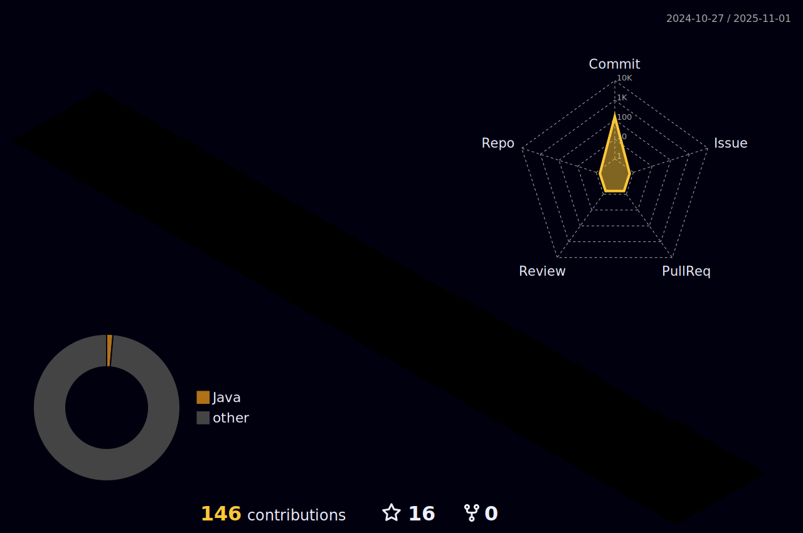

# :shamrock: BackEnd Developer

## 어제의 내가 최고가 되지 않게 하자 ♻️ 

🤍 [벨로그](https://velog.io/@punrabbit/posts)

:blue_heart: [깃허브 블로그](http://punrabbit.github.io)

:green_heart: [우당탕탕 웹툰사이트](https://www.juniverse.kro.kr) [오라클 이슈로 동작 중지 중...]

  

  

   

   

<!--
**PunRabbit/PunRabbit** is a ✨ _special_ ✨ repository because its `README.md` (this file) appears on your GitHub profile.

Here are some ideas to get you started:

- 🔭 I’m currently working on ...
- 🌱 I’m currently learning ...
- 👯 I’m looking to collaborate on ...
- 🤔 I’m looking for help with ...
- 💬 Ask me about ...
- 📫 How to reach me: ...
- 😄 Pronouns: ...
- ⚡ Fun fact: ...
-->

<!--
### Stacks   
 

 

 

   
-->

   

<!---->

